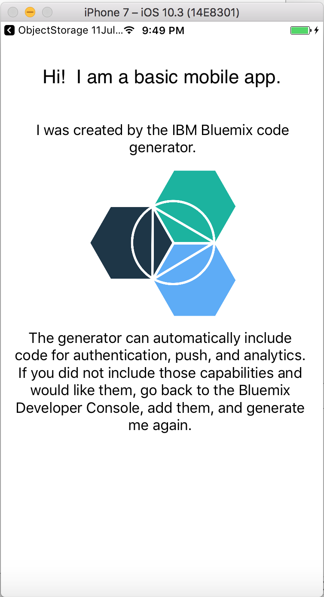

## Basic Starter
Basic IBM Cloud Mobile Starter in Swift

[](https://bluemix.net)
[](https://developer.apple.com/swift/)

### Table of Contents
* [Summary](#summary)
* [Requirements](#requirements)
* [Configuration](#configuration)
* [Run](#run)
* [License](#license)

### Summary

The Basic IBM Cloud Mobile Starter project has integration points (by default) for Push Notification and Mobile Analytics services and it can also be extended to add other IBM Cloud Mobile services.

### Requirements

* iOS 8.0+
* Xcode 8.0
* Swift 3.0

### Configuration
* [IBM Cloud Mobile services Dependency Management](#bluemix-mobile-services-dependency-management)
* [Mobile Foundation Configuration (Optional)](#bluemix-mobile-services-mfp-dependency-management)

#### IBM Cloud Mobile services Dependency Management

This starter kit uses the IBM Cloud Mobile services SDKs to use the functionality of Mobile Analytics, Push Notifications.

The IBM Cloud Mobile services SDK uses [CocoaPods](https://cocoapods.org/) to manage and configure dependencies. To use our latest SDKs, you need version 1.1.0.rc.2.

You can install CocoaPods using the following command:

```bash
$ sudo gem install cocoapods --pre
```

If the CocoaPods repository is not configured, run the following command:

```bash
$ pod setup
```

For this starter, a pre-configured `Podfile` is included in the **ios_swift/Podfile** location. To download and install the required dependencies, run the following command in the **ios_swift** directory:

```bash
$ pod install
```
Open the Xcode workspace: `{APP_Name}.xcworkspace`. Continue to open the `.xcworkspace` file as it contains all the dependencies and configurations.

If you run into any issues during the pod install, it is recommended to run a pod update by using the following commands:

```bash
$ pod update
$ pod install
```

#### Mobile Foundation Configuration (Optional)
In case Mobile Foundation is added to the starter kit then follow the below pre steps.

##### Steps:

* Goto the project folder and find a shell scripts by name **mfpregisterapp.sh** and ensure that you have execute and write permissions in order to run these scripts.
* run **mfpregisterapp.sh**. This should set up the Mobile Foundation prereqs for running the starter.

### Run

Click **Product > Run** to start the app in Xcode.  You will see a screen like this:



The application has built-in integration hooks for Mobile Analytics, Push Notifications and Mobile Foundation service (if added).

### License
This package contains code licensed under the Apache License, Version 2.0 (the "License"). You may obtain a copy of the License at http://www.apache.org/licenses/LICENSE-2.0 and may also view the License in the LICENSE file within this package.

